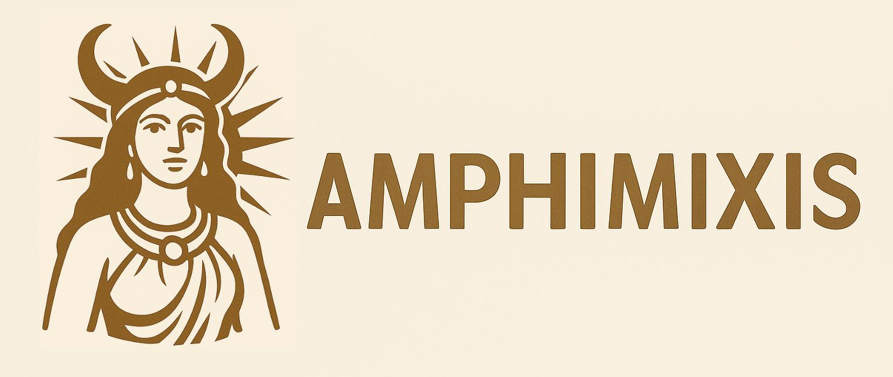

[](https://github.com/ebzych/amphimixis/actions/workflows/ci.yml)
[](https://github.com/ebzych/amphimixis/tree/main/docs)
[](https://github.com/ebzych/amphimixis/blob/main/LICENSE)

<p align="center">
  <br>
</p>

# Amphimixis

Amphimixis is an automated project intelligence and evaluation tool for performance and migration readiness. It helps inspect a project for existing infrastructure such as CI, tests, benchmarks, dependencies, and build scripts, then runs builds and collects performance data for further comparison.

## Quick run

If you want to try Amphimixis right away, create a virtual environment, install the package from GitHub, and run the full pipeline on a target project:

```bash
python3 -m venv .venv
source .venv/bin/activate
pip install git+https://github.com/ebzych/amphimixis.git
amixis /path/to/project
```

Before you run it, make sure your project has an `input.yml` configuration file. The format is described in [docs/config_instruction.md](docs/config_instruction.md).

If your `input.yml` contains remote machines authenticated with SSH keys, start `ssh-agent` in the current shell and add the required keys manually before running `amixis`:

```bash
eval "$(ssh-agent -s)"
ssh-add ~/.ssh/id_remote_machine
```

## Requirements

- Python 3.12 or later
- Linux
- `rsync` available on the machine where you run Amphimixis
- `sshpass` available on the machine where you run Amphimixis, if you connect to remote machines with passwords
- `perf` available on each `run_machine`
- `perf archive` available on each `run_machine`
- A supported build setup in the target project: CMake as the build system and Make as the low-level runner

## What Amphimixis does

Amphimixis can:

- analyze a project for CI, tests, benchmarks, build system configuration, and dependencies
- build the project with configured recipes and platforms
- profile executable runs and collect timing and `perf`-based statistics
- compare profiling outputs produced for different builds

## Typical usage

Prepare a working directory with an `input.yml` configuration file. The configuration format is described in [docs/config_instruction.md](docs/config_instruction.md).

Run the full workflow for a project:

```bash
amixis /path/to/project
```

This command:

1. analyzes the project
1. builds it using the selected configuration
1. profiles the resulting executables
1. prints profiling results in the console

To compare two collected `perf` outputs:

```bash
amixis --compare build1.scriptout build2.scriptout --max-rows 10
```

`--compare` accepts exactly two `.scriptout` files. `--max-rows` limits how many symbols with the largest delta are shown for each event.

For step-by-step command examples, custom configuration files, and `--events` usage, see [docs/usage_guide.md](docs/usage_guide.md).

## Build and run notes

The tool is distributed as a Python package with the `amixis` CLI entry point.

For local development and reproducible checks, the repository uses `uv` and GitHub Actions. The CI configuration is available in [.github/workflows/ci.yml](.github/workflows/ci.yml).

Useful commands during development:

```bash
uv run amixis --help
uv run pytest
```

If you want a more detailed walkthrough with installation options, workspace preparation, and command examples, see [docs/usage_guide.md](docs/usage_guide.md).

## Project structure

The repository is organized around a small CLI and several core modules:

- [amixis.py](amixis.py) is the command-line entry point
- [amphimixis/analyzer.py](amphimixis/analyzer.py) inspects a target project
- [amphimixis/builder.py](amphimixis/builder.py) runs configured builds
- [amphimixis/profiler.py](amphimixis/profiler.py) gathers execution and profiling data
- [amphimixis/validator.py](amphimixis/validator.py) validates `input.yml`
- [amphimixis/shell](amphimixis/shell) contains local and remote shell backends
- [docs](docs) contains user-facing documentation

## Documentation

Additional documentation:

- [docs/usage_guide.md](docs/usage_guide.md)
- [docs/config_instruction.md](docs/config_instruction.md)

## How To Help

Contributions are welcome.

- Report bugs and suggest improvements through GitHub Issues
- Open a Pull Request with a clear description of the problem and the proposed change
- Add or improve tests for new behavior
- Update documentation when changing CLI behavior or configuration format

Before contributing, make sure local checks pass:

```bash
ci/runner.sh
```

## License

The project is distributed under the license in [LICENSE](LICENSE).
